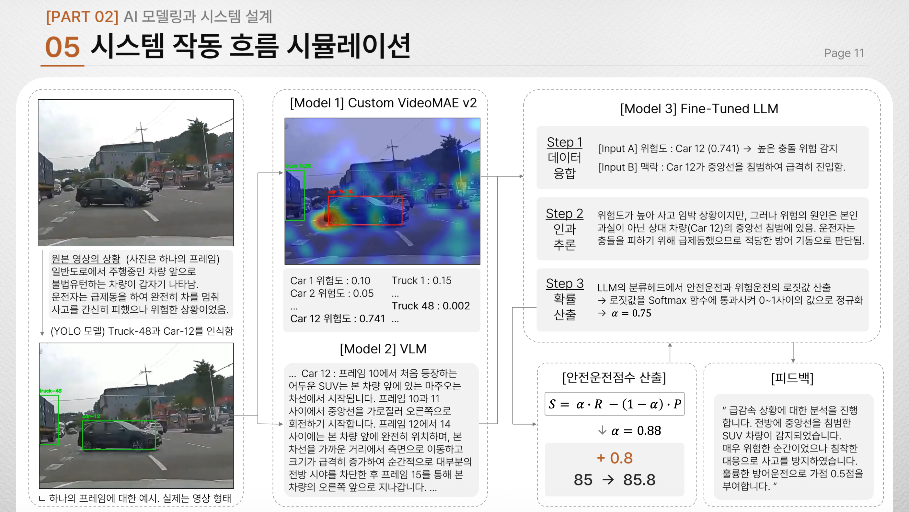

# Explainable UBI

블랙박스 영상 기반 객체 추적·사고 위험도 분석·상황 설명 프로젝트.

## 처리 흐름

`영상 → YOLO 객체 추적 → VideoMAE 위험도 분석 → VLM 상황 설명`



## 모델 구성


| 구성 | 내용 |
| --- | --- |
| VideoMAE V2 | 사고 분류와 Grad-CAM 기반 객체 기여도 분석 |
| Perplexity API | 추적 프레임의 도로 상황과 객체 움직임을 JSON으로 정리 |
| LLaMA-3.1 | 위험도와 상황 맥락을 결합한 안전 운전 점수 산출 구조 설계 |

## 저장 파일

| 파일·폴더 | 내용 |
| --- | --- |
| [run_pipeline.py](run_pipeline.py) | YOLO → VideoMAE → VLM 순차 실행 |
| [VideoMAEv2](VideoMAEv2) | 학습·추론, 객체 추적, 기여도 시각화 코드 |
| [VLM_Project](VLM_Project) | 프레임 추출과 상황 분석 코드 |
| [train_label.csv](train_label.csv) | 학습 라벨 |
| [assets](assets) | 처리 흐름과 모델 설계 자료 |

## 실행

```bash
python run_pipeline.py \
  --video_path /path/to/video.mp4 \
  --output_dir ./output_analysis \
  --api_key "$PERPLEXITY_API_KEY"
```

현재 실행 경로는 `/workspace` 기준입니다. 모델 가중치, 필요한 Python 패키지, API 키는 별도로 준비합니다.

## 결과 예시

| 결과 | 저장된 예시 |
| --- | --- |
| 객체 추적 영상 | [YOLO 추적 결과](VideoMAEv2/test_video_vis_obj/yolo_only_test8-2.mp4) |
| 객체 기여도 영상·데이터 | [분석 영상](VideoMAEv2/test_video_vis_obj/obj_attrib_test8-2.mp4) · [JSON](VideoMAEv2/test_video_vis_obj/obj_attrib_test8-2.mp4.json) |
| 상황 설명 | [VLM 분석 JSON](VLM_Project/debug_frame/yolo_only_test8-2/vlm_analysis.json) |
