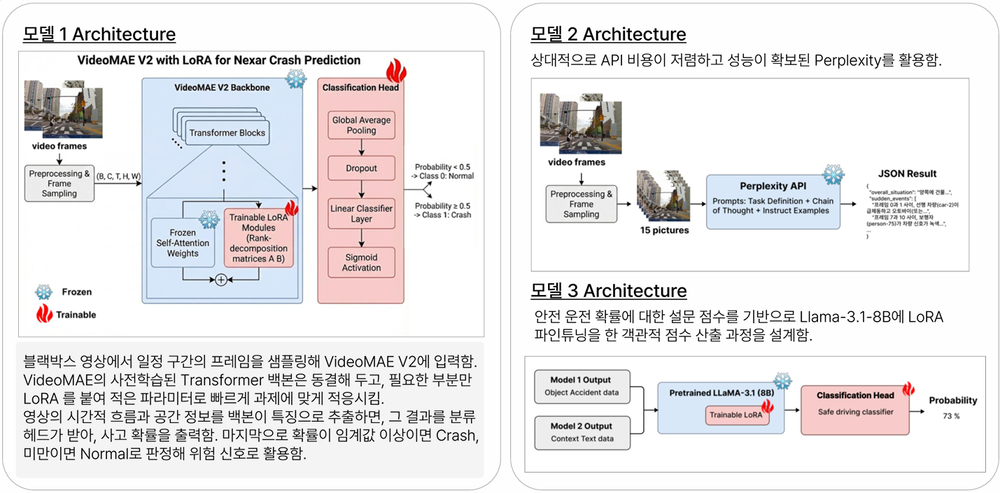

# 🚗 End-to-End Accident Analysis Pipeline

블랙박스/자율주행 영상에서 객체를 추적하고, 위험 상황을 분류하며, 시각-언어 모델(VLM)을 이용해 전반적인 사고 맥락을 분석하여 최종적인 안전 운전 확률을 산출하는 통합 파이프라인입니다.

## 🌟 시스템 아키텍처



본 프로젝트는 아래 3가지 모델 아키텍처가 결합되어 작동합니다.

### 1️⃣ 모델 1: VideoMAE V2 with LoRA for Nexar Crash Prediction
- **역할**: 비디오 프레임 내 시공간적 특징을 추출해 사고(Crash) 여부를 분류합니다.
- **구조**: 
  - 블랙박스 영상에서 일정 구간의 프레임을 샘플링하여 VideoMAE V2에 입력합니다.
  - 사전학습된 Transformer 백본은 동결(Frozen)하고, **LoRA(Low-Rank Adaptation)** 모듈만 추가해 적은 파라미터로 효율적인 미세조정(Fine-tuning)을 수행합니다.
  - 추출된 특징을 분류 헤드에서 받아 사고 확률을 출력하며, 임계값 이상이면 Crash(위험), 미만이면 Normal로 판정합니다.

### 2️⃣ 모델 2: Perplexity API 기반 Context Analysis
- **역할**: 상황 맥락(Context)을 텍스트의 형태로 분석하여 줍니다.
- **구조**: 
  - 객체가 추적된 비디오 프레임들을 캡처(예: 15 frames)하여 추출합니다.
  - 상대적으로 API 비용이 저렴하고 성능이 우수한 **Perplexity API** (VLM)에 프레임들을 전달합니다.
  - 프롬프트 튜닝(Chain of Thought + Instruct Examples)을 적용하여 전체적인 상황, 갑작스런 이벤트 등을 상세한 JSON 포맷으로 도출합니다.

### 3️⃣ 모델 3: LLaMA-3.1-8B 기반 객관적 점수 산출 프로세스
- **역할**: 최종적인 안전 운전 확률(Safe driving score)을 산출합니다.
- **구조**:
  - 모델 1의 결과 (Object/Accident Data)와 모델 2의 결과 (Context Text Data)를 종합합니다.
  - 설문 점수 기반으로 구축된 데이터로 **Pretrained LLaMA-3.1 (8B)** 모델에 **LoRA** 파인튜닝을 적용하였습니다.
  - 분류 헤드(Safe driving classifier)를 거쳐 최종적으로 객관적인 확률(Probability, 예: 73%)을 도출해 냅니다.

---

## 🚀 파이프라인 실행 방법 (`run_pipeline.py`)

파이프라인은 영상 하나를 입력으로 받아 `YOLO ➡️ VideoMAE ➡️ VLM`의 단계를 순차적으로 자동 실행합니다.

### 필수 요구사항
- `VideoMAEv2/` 및 `VLM_Project/` 디렉토리 하위 스크립트
- 학습된 가중치 모델들 (`yolo11x.pt` 등)
- Python 3.x 환경 (의존성 패키지 설치 필요)
- Perplexity API 키 (또는 기타 VLM 키)

### 명령어
```bash
python run_pipeline.py --video_path [비디오 절대경로] --output_dir [결과 저장 폴더]
```

### 실행 프로세스
1. **YOLO Tracking**: 영상 내 차량/보행자를 추적 및 레이블링 (JSON 및 `.mp4` 생성)
2. **VideoMAE Object Attribution**: 추적된 객체의 위험도/히트맵 속성 분석
3. **VLM Frame Extraction**: 추적된 영상에서 분석을 위한 프레임 일정 간격(Step) 추출
4. **VLM Context Analysis**: API를 호출해 영상의 도로 상황과 사고의 정황을 텍스트(JSON)로 리포팅

## 📁 결과물
- **`yolo_only_{name}.mp4`**: YOLO 추적 박스가 표시된 영상
- **`obj_attrib_{name}.mp4`**: 위해도 및 속성이 매핑된 영상
- **`vlm_analysis.json`**: 모델 2가 출력한 종합 상황 텍스트 리포트 데이터
